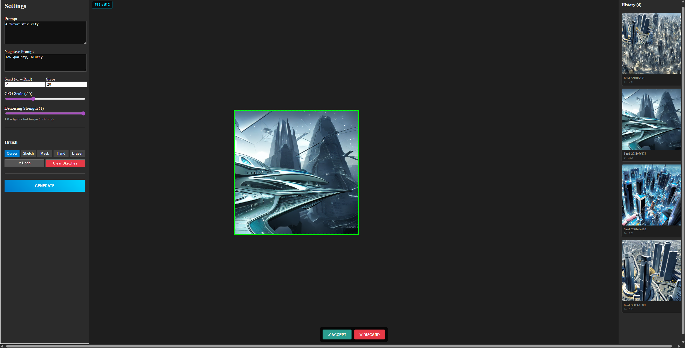

# Local AI Image Editor (Infinite Canvas)

Локальный сервис для AI-генерации изображений на бесконечном холсте (Photoshop Generative Fill).

## 🚀 Основные возможности



### Генерация и Редактирование
*   **Бесконечный холст**: Рисуйте, генерируйте и расширяйте изображения в любую сторону.
*   **Txt2Img & Img2Img**: Классическая генерация по тексту и на основе набросков.
*   **Outpainting**: Просто поместите рамку на прозрачную область или край изображения — система автоматически "дорисует" продолжение.
*   **Inpainting**: Используйте маску (красный цвет), чтобы изменить конкретные детали.
*   **Sketch-to-Image**: Нарисуйте скетч кистью (серый фон подставится автоматически) и превратите его в полноценный арт.

### Управление слоями (Staging & Baking)
*   **Staging Area**: Сгенерированное изображение сначала появляется как "кандидат" (в зеленой рамке).
*   **Merge on Accept**: При нажатии **ACCEPT**, изображение "запекается" в холст, объединяясь с фоном. Это позволяет держать холст производительным (single layer experience).
*   **Resizable Frame**: Рамку генерации можно растягивать. Размер автоматически прилипает к значениям кратным 64px (например, 512x768).

### Инструменты UI
*   **Инструменты**: Кисть, Ластик, Маска, Рука (Pan).
*   **Resolution Badge**: Отображение текущего разрешения генерации в левом верхнем углу.
*   **Hotkeys**:
    *   `Space` (удерживать): Панорамирование (Pan).
    *   `Ctrl+Z`: Отмена действия (Undo).
    *   `Delete`: Удаление выделенного объекта.
    *   `[ / ]`: Изменение размера кисти.

## 🛠 Технический стек
*   **Frontend**: React, Pure Fabric.js (Canvas Logic), Vite.
*   **Backend**: Python, FastAPI, Diffusers, Torch.
*   **Prompt Transformer**: backend-модуль для интеграции локальной LLM перед SD.
*   **Оптимизация**:
    *   Автоматическая выгрузка моделей из VRAM.
    *   Оффлайн-режим (попытка загрузки локальных кэшированных моделей).
    *   fp16 / xformers для скорости.

## 📦 Установка и Запуск

### 1. Настройка Backend
```bash
cd backend

# Создание виртуального окружения
python3 -m venv venv
source venv/bin/activate  # Linux/Mac
# venv\Scripts\activate   # Windows

# Установка зависимостей
pip install -r requirements.txt

# Запуск сервера
python -m uvicorn main:app --reload --port 8000
```

### 2. Настройка Frontend
```bash
cd frontend

npm install
npm run dev
```

### 3. Prompt Transformer (подготовка под локальную LLM)
По умолчанию трансформер выключен и не влияет на текущий pipeline.

```bash
export PROMPT_TRANSFORM_ENABLED=true
export PROMPT_TRANSFORM_TIMEOUT_MS=1500
export PROMPT_TRANSFORM_PROVIDER=stub
export PROMPT_TRANSFORM_STRICT=true
export PROMPT_NEGATIVE_MERGE_POLICY=append
```

Полезные endpoint-ы:
- `POST /prompt/transform` — превью трансформации промпта без запуска SD.
- `GET /prompt/health` — статус загрузки prompt-transformer и LLM-адаптера.
- `POST /generate` — поддерживает поля `raw_prompt` и `use_prompt_transform`.
- Если трансформация включена и не удалась, backend вернет `422` и не запустит SD.

### 4. Qwen GGUF + LoRA (runtime)
Для провайдера `qwen_gguf` подготовлены env-параметры:

```bash
export PROMPT_TRANSFORM_PROVIDER=qwen_gguf
export LLM_MODEL_PATH=/abs/path/to/qwen3-1.7b.gguf
export LLM_LORA_PATH=/abs/path/to/your_adapter.gguf
export LLM_LORA_SCALE=1.0
export LLM_CTX_SIZE=4096
export LLM_THREADS=6
export LLM_GPU_LAYERS=0
export LLM_MAX_NEW_TOKENS=220
export LLM_TEMPERATURE=0.2
export LLM_TOP_P=0.9
```

Примечание: для `qwen_gguf` нужен установленный `llama-cpp-python`.

## 🎮 Как пользоваться
1.  **Навигация**: Зажмите `Пробел` и тяните мышкой для перемещения. Колесико — зум.
2.  **Генерация**:
    *   Переместите синюю рамку в нужное место.
    *   (Опционально) Нарисуйте скетч или маску внутри.
    *   Введите промпт и нажмите **GENERATE**.
3.  **Принятие результата**:
    *   Картинка появится поверх холста.
    *   Нажмите **GENERATE** еще раз, чтобы заменить вариант, или **ACCEPT**, чтобы вклеить его в холст.
    *   Нажмите **DISCARD**, чтобы удалить.

## 📂 Структура проекта
```
.
├── backend/
│   ├── core/
│   │   ├── manager.py   # Model Manager (VRAM logic)
│   │   ├── llm_adapter.py # GGUF/LoRA adapter layer
│   │   ├── prompt_transformer.py # Prompt -> SD prompt service (LLM hook)
│   │   └── utils.py     # Image processing helpers
│   └── main.py          # FastAPI Endpoints
└── frontend/
    ├── src/
    │   ├── components/
    │   │   ├── Editor.jsx  # React State & Fabric wrappers
    │   │   └── Sidebar.jsx # Параметры генерации
    │   └── utils/
    │       └── canvasLogic.js # Чистая логика Canvas (Export/Merge/Undo)
```
